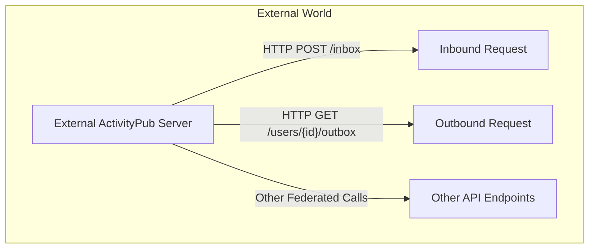
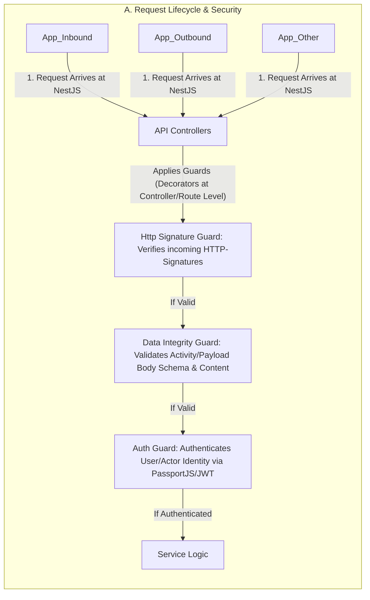
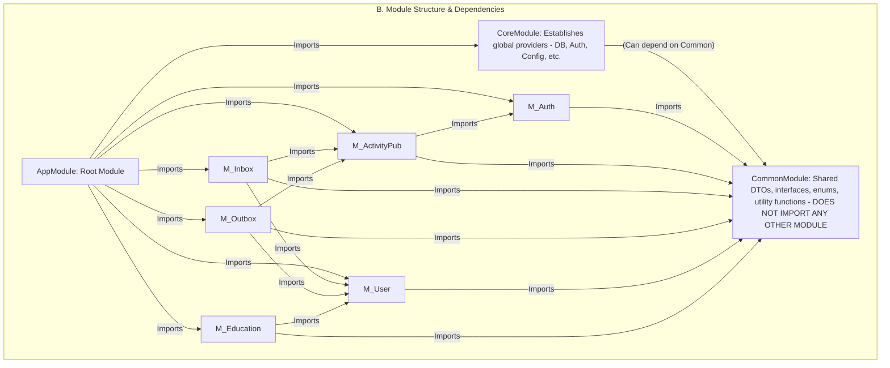
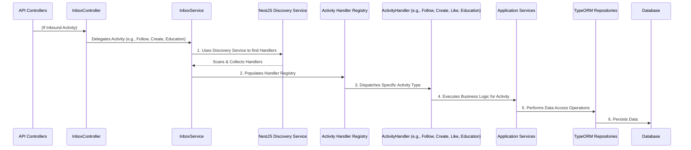
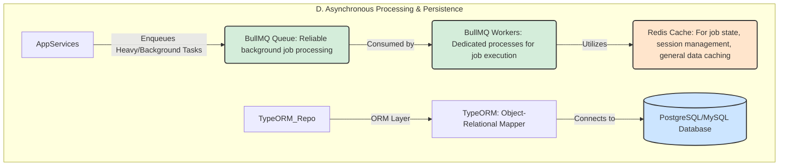
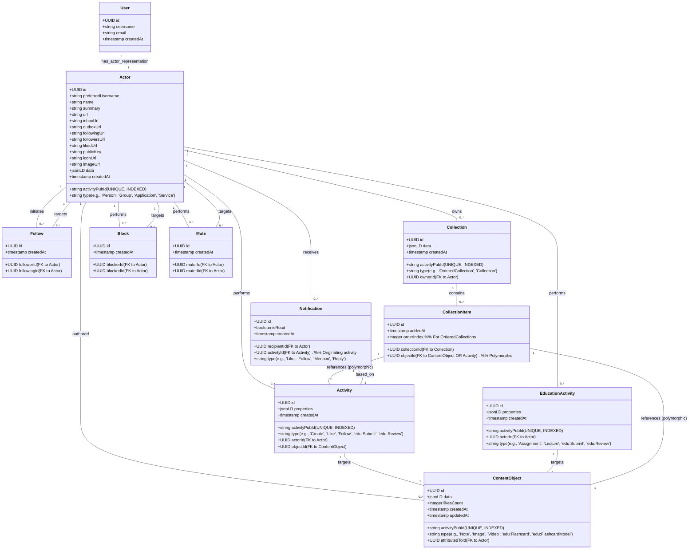
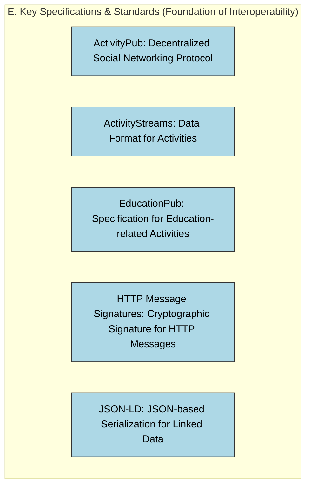

## **Decentralized Federated Platform Architecture Overview**

This document provides a comprehensive architectural blueprint for a robust, scalable, and decentralized federated social and education platform. Built upon industry-leading specifications like ActivityPub and ActivityStreams 2.0, with an extensible EducationPub vocabulary, this architecture leverages NestJS, TypeORM, Redis, and BullMQ to address the unique challenges of federated systems. From secure request processing and modular design to efficient asynchronous workflows and a flexible database model, this overview aims to guide the creation and maintenance of a high-performance, interoperable fediverse instance.

### **External World Interactions**

This diagram illustrates how the platform interacts with external ActivityPub servers and handles inbound and outbound federated requests using a **Flowchart**.  

### **A. Request Lifecycle & Security**

This section details the flow of incoming requests through the NestJS application, focusing on the security guards that ensure proper HTTP Signature verification, data integrity, and user/actor authentication.

### **B. Module Structure & Dependencies**

This diagram outlines the modular architecture of the NestJS application, highlighting how modules are organized and depend on each other, with special attention to the Core and Common modules and the prevention of circular dependencies.

### **C. Inbox Processing & Activity Handling**

This section illustrates the crucial process of handling inbound ActivityPub activities, showing how the NestJS Discovery Service delegates different activity types to specialized handlers.

#### **Activity Handler Flow within Services**

Activity handlers act as orchestrators for specific ActivityPub or ActivityStreams types. Once the InboxService dispatches an incoming activity to the appropriate ActivityHandler, the handler's primary role is to coordinate the necessary business logic across various application services and persist data through repositories.  
In a generic flow:

1. **Validation & Pre-processing:** The handler performs any final, activity-specific validation or pre-processing of the incoming payload.  
2. **Service Invocation:** It calls one or more Application Services (e.g., UserService, ContentService, FollowService, EducationService) to execute the core business logic related to the activity. These services encapsulate the complex rules and operations for their respective domains.  
3. **Data Persistence:** The Application Services then interact with TypeORM Repositories. Repositories provide the abstraction layer for database operations, abstracting away the specifics of querying and persisting entities.

##### **Robust Example: Follow and Undo Follow Activities**

Let's illustrate with the Follow and Undo Follow activities:  
**Scenario 1: Receiving a Follow Activity**

* An external actor (e.g., Alice@remote.social) sends a Follow activity targeting a local actor (e.g., Bob@yourinstance.social).  
* **FollowActivityHandler:**  
  * Receives the Follow activity from the InboxService.  
  * Validates the activity (e.g., ensures Alice and Bob are valid actors, Bob isn't already following Alice).  
  * Calls FollowService.createFollow(followerActorId, followedActorId).  
* **FollowService:**  
  * Begins a database transaction.  
  * Uses FollowRepository to create a new Follow entity record in the database, linking Alice's Actor.id to Bob's Actor.id.  
  * Updates Alice's Actor.followingCount and Bob's Actor.followersCount (denormalized counters).  
  * Commits the transaction.  
  * Optionally, it might enqueue a job to an OutboxService to send an Accept activity back to Alice's instance, acknowledging the follow.  
  * Might also create a Notification for Bob (e.g., "Alice started following you").

**Scenario 2: Receiving an Undo Activity (targeting a Follow object)**

* Alice@remote.social sends an Undo activity, where the object of the Undo activity is the Follow activity she previously sent to Bob. This signifies an unfollow.  
* **UndoActivityHandler:**  
  * Receives the Undo activity from the InboxService.  
  * Identifies that the object of the Undo activity is a Follow relationship.  
  * Calls FollowService.removeFollow(followerActorId, followedActorId).  
* **FollowService:**  
  * Begins a database transaction.  
  * Uses FollowRepository to find and delete the existing Follow entity record between Alice and Bob.  
  * Decrements Alice's Actor.followingCount and Bob's Actor.followersCount.  
  * Commits the transaction.  
  * Optionally, it might enqueue a job to send a Reject or Undo acknowledgement back to Alice's instance.  
  * Might create a Notification for Bob (e.g., "Alice unfollowed you").

This granular approach ensures each activity type is handled consistently, leveraging service-oriented business logic and robust data persistence.

### **D. Asynchronous Processing & Persistence (Flows)**

This diagram highlights the platform's asynchronous processing capabilities using BullMQ for background jobs and Redis for caching.  

#### **BullMQ and Redis \- Managing Asynchronous Workloads**

In a federated social platform, many operations are inherently asynchronous and can be resource-intensive, making a dedicated job queue system like BullMQ (backed by Redis) essential. This design decouples immediate API responses from long-running tasks, ensuring a responsive user experience.  
**Types of Jobs Handled by BullMQ:**

* **Federated Activity Delivery (Fan-out):** When a local actor publishes an activity (e.g., creates a Note or Flashcard), this activity needs to be delivered to the inboxes of all followers, potentially across many remote instances. This fan-out process is a prime candidate for a background job, as it can involve numerous HTTP requests. BullMQ can manage retries, rate-limiting per remote instance, and ensure eventual delivery.  
* **Remote Object Fetching/Dereferencing:** When an activity references an object from a remote instance (e.g., a Like activity targeting a remote Note), the platform might need to fetch and cache the full JSON-LD representation of that object. This can be a background job to avoid blocking the initial inbox processing.  
* **Media Processing:** Uploads of images, videos, or audio for ContentObjects might require resizing, transcoding, or generating thumbnails. These CPU-bound tasks are best handled asynchronously.  
* **Cache Invalidation & Synchronization:** While some cache invalidation can be synchronous, complex scenarios (e.g., invalidating multiple related cached entries, or periodically syncing specific remote data) can be offloaded to jobs.  
* **Data Cleanup & Retention:** Scheduled tasks for soft-deleting old data, purging records beyond retention policies, or optimizing database tables can be managed as recurring background jobs.  
* **HTTP Signature Key Rotation/Management:** Periodic tasks to refresh or update public keys for remote actors.

**Role of Redis:**  
Redis serves as the highly performant backend for BullMQ, storing job queues, job states, and worker locks. Beyond BullMQ, Redis is also strategically used for:

* **General Caching:** Caching frequently accessed data like actor profiles (local and remote), popular content, or configuration settings to reduce database load and improve read speeds.  
* **Rate Limiting:** Storing counters and timestamps for API rate limiting to protect against abuse and DoS attacks.  
* **Pub/Sub Mechanism:** Potentially used for real-time notifications or internal event broadcasting within the application.

This asynchronous architecture, powered by BullMQ and Redis, ensures that the platform remains performant and resilient under varying loads, gracefully handling the distributed nature of the ActivityPub protocol.

### **D.1 Data Model (Class Diagram)**

This **UML/Class Diagram** provides a detailed representation of the proposed database schema, illustrating the core entities, their attributes, and relationships, designed to support ActivityPub/ActivityStreams 2.0 and the EducationPub vocabulary for flashcards.  

### **E. Key Specifications & Standards**

This section lists the foundational specifications and standards that ensure the platform's interoperability and adherence to industry best practices.

### **F. Database Design Challenges and Solutions**

Implementing ActivityPub with its flexible, graph-like data model (ActivityStreams 2.0 and JSON-LD) onto a relational database like PostgreSQL using TypeORM introduces several unique challenges. This section summarizes these issues and the architectural solutions adopted.

#### **URI Management and Identity**

ActivityPub objects are identified by unique, dereferencable HTTPS URIs. Directly using these long string URIs as primary keys can lead to performance degradation due to larger indexes and slower comparisons.  
**Solution:** Adopt an "Internal ID vs. External URI" pattern. Use efficient internal primary keys (e.g., UUID or BIGINT) for TypeORM entities, and store the ActivityPub URI as a separate, unique, and indexed VARCHAR/TEXT column. The external id in the JSON payload can be dynamically generated. This approach also necessitates robust URI canonicalization and object deduplication strategies to maintain data integrity and prevent duplicates.

#### **Modeling Relationships and Collections**

Representing ActivityStreams relationships (like Follow, Like, Announce) and managing OrderedCollections (Inbox, Outbox) within a relational schema presents complexities, especially given ActivityPub's eventual consistency model. Polymorphic associations, where a single entity (e.g., Activity) can relate to multiple types of objects (e.g., Note, Image), also pose a challenge for traditional ORMs.  
**Solution:** Store ActivityPub relationships as explicit Activity records with foreign keys to actors and objects. For persistent relationships (like follows), use dedicated join tables. For OrderedCollections, rely on stable ordering keys like immutable timestamps. While TypeORM doesn't natively support polymorphic associations, libraries like typeorm-polymorphic can assist, often requiring application-level validation or database-level features (triggers/check constraints) to enforce integrity. Embrace eventual consistency for federated collections, focusing on local consistency where possible.

#### **Leveraging PostgreSQL's JSONB Capabilities**

ActivityPub's schema flexibility and nested JSON-LD objects require a flexible storage solution within a relational database.  
**Solution:** Utilize PostgreSQL's JSONB columns to store dynamic, flexible JSON-LD payloads directly within relational tables. For frequently accessed or critical fields within the JSONB payload, "promote" them to dedicated, first-class relational columns to benefit from traditional indexing and query optimization (the "Hybrid Schema" approach). For efficient querying of JSONB data, employ Generalized Inverted Indexes (GIN indexes), often requiring manual definition in TypeORM migrations to specify operator classes for optimal performance.

