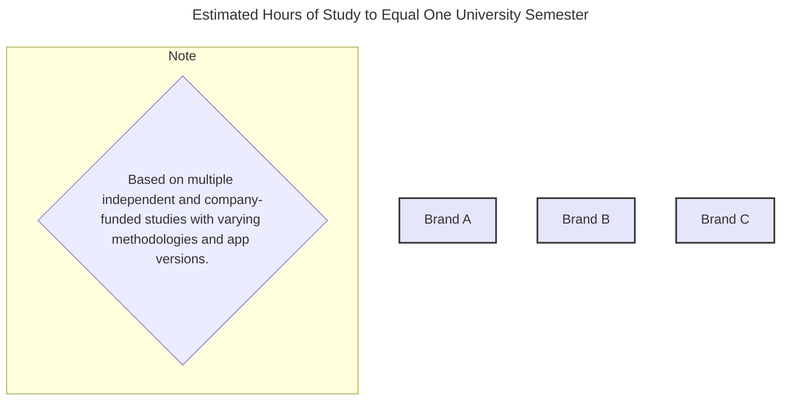

# The Pedagogy of Platforms: An Evidence-Based Report on Best Practices in Digital Language Learning

## Section 1: The Foundations of Effective Language Acquisition

To accurately evaluate the efficacy of any language learning method, whether institutional or digital, it is imperative to first establish the foundational, evidence-based principles that govern how humans acquire a new language. Decades of research in the fields of Second Language Acquisition (SLA), cognitive science, and linguistics have produced a robust consensus on the core mechanisms of language learning. These principles, derived from peer-reviewed studies published in leading journals such as *Studies in Second Language Acquisition* and *The Modern Language Journal* [1, 2, 3], form the theoretical framework and primary evaluation rubric for this report. The most effective learning methodologies are not those with the most features, but those that align most closely with these fundamental truths of human cognition.

### 1.1 Core Principles from Second Language Acquisition (SLA) Research

The field of SLA provides several non-negotiable principles that form the bedrock of modern language pedagogy.

**The Primacy of Comprehensible Input**
The single most influential concept in the field is Stephen Krashen's Input Hypothesis, which posits that humans acquire language in only one way: by understanding messages, or by receiving "comprehensible input".[4, 5] This input must contain language structures that are slightly beyond the learner's current level of competence (a concept denoted as '$i+1$'). For this process to occur, the input must be meaningful, relevant, and interesting to the learner. This engagement lowers the "affective filter"—a metaphorical barrier of anxiety or low motivation that can prevent input from being processed for acquisition.[5, 6] Input that is boring, irrelevant, or incomprehensible is little more than noise and does not lead to acquisition.

**The Role of Meaningful Output**
While input is the fuel for acquisition, output—the act of producing language through speaking or writing—is a critical part of the engine. Merrill Swain's Output Hypothesis argues that when learners are pushed to produce language, they are forced to move from semantic processing (just understanding the meaning) to full syntactic processing (organizing words and grammar to convey a precise message).[6] This process helps learners notice gaps in their linguistic knowledge, test hypotheses about how the language works, and develop greater automaticity and control over their existing knowledge.[6] Meaningful output is not rote practice; it is the active, creative use of language to achieve a communicative goal.

**The Interaction Hypothesis**
Language acquisition is fundamentally a social, not a solo, activity. The Interaction Hypothesis builds upon the input and output principles, demonstrating that face-to-face interaction is the crucible where acquisition is forged.[7, 8] Through the process of negotiating meaning—asking for clarification, rephrasing, and checking for understanding—learners make input more comprehensible for themselves and are pushed to produce more comprehensible output for their partners.[7] This reveals an interconnected, virtuous cycle: comprehensible input fuels acquisition, but interaction is often required to make that input comprehensible. This interaction, in turn, necessitates meaningful output, which elicits more tailored and comprehensible input from the interlocutor. Any learning environment that fails to facilitate this dynamic, interactive loop is pedagogically incomplete.

**The Acquisition-Learning Distinction and the Natural Order**
Krashen also proposed a critical distinction between two independent systems of second language performance: "acquisition" and "learning".[4, 5] Acquisition is the subconscious process, akin to how a child picks up their first language, that leads to intuitive, fluent use. Learning is the conscious process of studying rules and grammar. Fluency and spontaneous speech stem almost exclusively from acquisition. Conscious learning serves primarily as a "Monitor" or editor, which can be used to polish output in planned situations like writing or preparing a speech, but is too slow and cumbersome for real-time conversation.[5] Furthermore, research suggests that grammatical structures are acquired in a predictable "natural order," regardless of the order in which they are taught.[4, 5] This finding challenges the effectiveness of traditional, grammar-first syllabi that present rules in a sequence based on perceived simplicity rather than the brain's natural acquisition path.

### 1.2 The Cognitive Science of Learning a New Language

Cognitive science provides a deeper understanding of the mental processes underlying the principles of SLA. The field has moved beyond older models to embrace a more integrated view of how the brain learns.[9, 10, 11]

**Implicit vs. Explicit Learning**
The acquisition-learning distinction has a strong basis in cognitive psychology's concepts of implicit and explicit learning.
*   **Implicit Learning** is a subconscious process where the brain detects patterns, frequencies, and regularities in the environment without conscious effort.[12, 13] This powerful mechanism, often called statistical learning, allows an infant to segment the speech stream into words and learn grammatical patterns simply through exposure.[13] It is the cognitive engine of language acquisition and is essential for developing an intuitive "feel" for the language.
*   **Explicit Learning** is the conscious, deliberate effort to memorize facts, such as vocabulary lists and grammar rules.[12, 14] While useful for specific knowledge, it does not typically lead to the automatic, rapid processing required for fluent conversation.

**Memory and Spaced Repetition**
Effective learning requires transferring information from fragile short-term memory to robust long-term memory. A highly effective, evidence-based technique for this is the use of Spaced Repetition Systems (SRS).[15, 16] SRS algorithms present information (like a vocabulary flashcard) at increasing intervals of time, showing it just before the learner is about to forget it. This method has been proven to be far more efficient for long-term retention than massed practice (cramming).[16, 17]

**The Integrated Nature of Language and Cognition**
While earlier theories, such as Noam Chomsky's, proposed that language is a unique "mental organ" governed by a Universal Grammar separate from other cognitive functions, the modern consensus in cognitive science is more nuanced.[14] Language is now understood to be a highly specialized human ability that is nevertheless deeply integrated with and reliant upon general cognitive processes like perception, attention, memory, and pattern recognition.[10, 11, 14] This integrated view supports a holistic pedagogical approach that emphasizes learning through meaningful use and experience, rather than treating language as a set of abstract rules to be memorized in isolation.

### 1.3 The Goal: Communicative Competence

The ultimate goal of language learning is not to know all the rules, but to be able to use the language effectively to communicate. The vague term "fluency" is best replaced by the more precise and measurable framework of **Communicative Competence**, a concept central to Communicative Language Teaching (CLT).[8, 18, 19] This framework comprises four inter-related components:

1.  **Grammatical Competence:** The knowledge of the language code itself—vocabulary, pronunciation, sentence structure, and grammar. This is the foundation upon which communication is built.
2.  **Sociolinguistic Competence:** The ability to use language appropriately in different social situations. This includes understanding levels of formality, politeness conventions, and cultural references. For example, knowing when to use the formal "Sie" versus the informal "du" in German is a matter of sociolinguistic competence.
3.  **Discourse Competence:** The ability to combine language structures into a coherent and cohesive whole. This involves knowing how to structure a narrative, construct an argument, or participate in the turn-taking of a conversation.
4.  **Strategic Competence:** The ability to use communication strategies to compensate for limitations in one's language knowledge and to manage communication breakdowns. This includes skills like paraphrasing, asking for clarification, and using gestures to get a point across.

Crucially, language is inseparable from culture.[7] To learn a language is to learn the cultural norms, values, and worldviews embedded within it. Therefore, developing communicative competence requires not just linguistic knowledge, but intercultural understanding. Any pedagogical approach that focuses solely on grammatical competence at the expense of the other three components will fail to produce effective communicators.

## Section 2: The Institutional Gold Standard: A Focus on Proven Methodologies

Before analyzing digital platforms, it is essential to establish a benchmark for pedagogical excellence. This benchmark is found in the methodologies of world-renowned, non-profit cultural institutions whose primary mission is the effective teaching of their respective languages. The Goethe-Institut, Alliance Française, and Instituto Cervantes have decades of experience and have developed highly refined, research-informed pedagogical models. Their approaches, which stand in stark contrast to many for-profit digital platforms, provide a clear picture of what constitutes best practice in language education.

### 2.1 The Goethe-Institut's Action-Oriented Approach

The Goethe-Institut's teaching philosophy is a prime example of modern, evidence-based pedagogy. It is explicitly student-centered, interactive, and task-oriented, aligning closely with the principles of SLA and CLT.[20]

*   **Task-Oriented Learning:** The core of the Goethe-Institut method is that lessons are structured around completing real-life tasks, not simply drilling grammar points. For example, a lesson might involve students collaboratively planning a weekend trip or solving a logistical problem. Grammar and vocabulary are introduced and practiced as necessary tools to successfully complete the task, making their acquisition both contextual and meaningful.[20] This approach ensures that language is always learned for a communicative purpose.
*   **Student-Centered and Autonomous Learning:** The curriculum is designed to be flexible, taking into account the diverse backgrounds, interests, and needs of individual students.[20] A key goal is to promote learner autonomy by helping students become conscious of and take responsibility for their own learning processes. They are encouraged to use their existing linguistic experiences and are prepared for future language learning.[20]
*   **Learning in a Cultural Context:** The institute recognizes that language and culture are inextricably linked. Instruction is always embedded in a cultural context, and students are encouraged to compare and contrast German culture with their own. This develops not only their linguistic skills but also their intercultural competence, preparing them to navigate the social realities of the German-speaking world.[20, 21]
*   **Rigorous Teacher Training and Innovation:** The quality of the Goethe-Institut's programs is underpinned by its commitment to highly qualified teachers who are specifically trained in its research-informed methodology.[22, 23] Furthermore, the institute demonstrates a forward-thinking approach to technology through its **Goethe-Lab Sprache**. This innovation unit is not seeking to replace its pedagogical model with technology, but to enhance it. It explores how new technologies like AI can be integrated in a didactically meaningful way, focusing on user-centric design and collaboration with leading research institutions to create tailor-made digital solutions.[24, 25]

### 2.2 Comparative Analysis of Institutional Pedagogy: Alliance Française & Instituto Cervantes

The Goethe-Institut's methodology is not an outlier; it reflects a broad consensus among premier cultural institutions.

*   **Alliance Française:** This institution also employs an "action-oriented and communicative pedagogy".[26, 27] Its focus is on enabling learners to use French to carry out practical tasks in authentic contexts, from organizing a meeting to conducting an interview. Immersion is a core tenet, with French being the only language of communication in the classroom from the very beginning, even at the introductory level.[28]
*   **Instituto Cervantes:** Similarly, the Instituto Cervantes utilizes an "interactive and dynamic methodology" where the goal is to integrate the learner into the Spanish-speaking community through authentic experiences.[29, 30] From day one, Spanish is the exclusive language of instruction, forcing learners to engage with the language directly and gain confidence through use.[31]

A critical common thread among all three institutions is their foundational alignment with the **Common European Framework of Reference for Languages (CEFR)**.[26, 27, 29, 32] The CEFR provides a detailed, internationally recognized standard for describing language ability across six levels (A1, A2, B1, B2, C1, C2). This ensures that proficiency is measured in a standardized, transparent, and holistic way, encompassing all aspects of communicative competence. This stands in sharp contrast to the often proprietary, vague, and non-standardized leveling systems used by many digital platforms.

### 2.3 The Indispensable Role of the Educator and Curriculum

The success of these institutional models underscores two elements that are often downplayed or absent in purely digital solutions: the expert human educator and the structured long-term curriculum.

The role of the teacher in this model is not that of a lecturer who dispenses grammatical knowledge, but that of a **facilitator, guide, and expert interlocutor**.[19, 22, 33] The teacher designs and facilitates the communicative tasks, provides scaffolding, manages group dynamics, and offers nuanced, corrective feedback that is tailored to the learner's specific error. This human element is critical for navigating the complexities of real-time interaction.

Equally important is the presence of a **structured, long-term curriculum**.[34, 35] These institutions design syllabi that spiral, systematically revisiting concepts in increasing depth and complexity over time. This ensures a coherent and logical progression that builds a robust and interconnected knowledge base. This is fundamentally different from many app-based models that allow users to jump between disconnected lessons, which can lead to a fragmented and superficial understanding of the language system.

The combination of a structured curriculum, peer interaction, and a teacher-facilitator creates a powerful learning ecosystem. This ecosystem provides the key ingredients for acquisition outlined in Section 1: a consistent supply of comprehensible input, constant opportunities for meaningful output, and a rich environment for authentic interaction, all within a low-anxiety community of fellow learners. This social and accountability-driven framework is a core strength of the institutional model and a primary challenge for solo-use digital platforms to replicate.

**Table 2.1: Pedagogical Framework Comparison: Institutions vs. Common App Model**

The following table starkly contrasts the deep, integrated pedagogical models of these premier institutions with the often-simplified models of many popular digital platforms. It visually summarizes the "pedagogical gap" that is a central theme of this report.

| Feature | Institutional Standard (Goethe, Alliance, Cervantes) | Common App Model (Duolingo, Rosetta Stone) |
|---|---|---|
| **Core Goal** | Communicative Competence [18] | Vocabulary/Grammar Mastery, Gamified Progress |
| **Methodology** | Communicative Language Teaching (CLT), Task-Based Learning [20, 26, 29] | Implicit Learning, Spaced Repetition, Immersion via Association [12, 36] |
| **Interaction** | Learner-Learner & Learner-Teacher (Human) [20, 37] | Learner-System (Machine) [15, 38] |
| **Grammar** | Taught as a concept in meaningful context [8, 20] | Taught via isolated drills or implicitly through pattern matching [12, 39] |
| **Culture** | Integrated, comparative, and core to curriculum [20, 21] | Often superficial "culture notes" or absent [40, 41] |
| **Feedback** | Corrective, explanatory, from a human facilitator [19, 22] | Binary (right/wrong), automated [42, 43] |
| **Proficiency Standard** | CEFR (A1-C2) [27, 29, 32] | Proprietary levels, often with aspirational CEFR alignment [44, 45] |

## Section 3: A Critical Analysis of Digital Language Learning Platforms

This section applies the pedagogical frameworks established in the preceding sections to critically evaluate the methodologies of leading digital language learning platforms. By juxtaposing their approaches with the principles of SLA and the gold standard of institutional teaching, we can identify their strengths, expose their pedagogical weaknesses, and chart a course for improvement.

### 3.1 Methodological Deep Dive: Duolingo, Babbel, and Rosetta Stone

**Duolingo: Gamified Implicit Learning**
Duolingo's methodology is built around maximizing user engagement through gamification. It employs short, game-like lessons, points, leaderboards, and "streaks" to encourage daily use.[46, 47] Its primary pedagogical approach is **implicit learning**. Users are exposed to a high volume of sentences and are expected to unconsciously absorb grammatical patterns and vocabulary through repetition and variation, much as a child learns their first language.[12, 39] The platform leverages cognitive science principles like statistical learning but largely eschews the explicit grammar instruction and communicative practice central to CLT.[12] While it claims alignment with the CEFR, its focus is on building a foundation through interactive, pattern-based exercises.[44]

**Babbel: Conversation-Focused Didactics**
Babbel positions itself as "the shortest path to real-life conversations".[48] Its lessons are structured around practical, conversational dialogues, such as ordering in a restaurant or booking a hotel room.[16, 49] Unlike Duolingo, Babbel incorporates **explicit grammar tips** and explanations within its lessons and uses native speaker audio rather than text-to-speech.[15, 48] It employs scientifically-backed cognitive techniques like **spaced repetition** to move vocabulary into long-term memory.[16] Its pedagogical model is a hybrid, combining elements of CLT (dialogue focus) with more traditional cognitivist and behaviorist approaches (explicit rules, drills).[16] Recognizing the limitations of a purely app-based approach, Babbel also offers **Babbel Live**, a service providing access to live online classes with human tutors, moving it closer to the institutional model.[50]

**Rosetta Stone: "Dynamic Immersion"**
Rosetta Stone's methodology is its most famous and controversial feature: **"Dynamic Immersion"**.[36] The platform strictly avoids any use of the learner's native language for translation or explanation.[42] Instead, it teaches vocabulary and grammar by having users match words and sentences to a curated set of images, forcing them to infer meaning directly from visual context.[36] The pedagogical theory is to digitally replicate the immersive environment in which a child learns their first language, bypassing translation to help the user "think" in the new language.[36, 38] The system relies heavily on repetition and its "TrueAccent" speech recognition engine to guide pronunciation.[51]

### 3.2 What Platforms Are Doing Well: The Strengths

Despite pedagogical shortcomings, digital platforms have made significant positive contributions to language learning.

*   **Accessibility and Motivation:** Their greatest success is in democratization. By offering free or low-cost access, platforms like Duolingo have lowered the barrier to entry for millions of potential learners.[52] Their use of gamification is highly effective at building initial habits and sustaining short-term motivation, solving the crucial problem of getting learners to start and stick with a daily practice.[47, 53, 54]
*   **Building Foundational Knowledge:** The platforms are demonstrably effective at teaching a foundational base of vocabulary and basic sentence patterns.[55, 56, 57] The structured drills and use of techniques like spaced repetition are well-suited for the explicit learning of these discrete language components.[16]
*   **Creating Low-Anxiety Environments:** For many beginners, the fear of making mistakes in front of peers or a teacher can be a significant psychological barrier (a high "affective filter"). Practicing with an app provides a private, non-judgmental space to engage with the language, which can build confidence and lower anxiety.[54, 58]

### 3.3 Where Platforms Are Falling Short: The Pedagogical Gap

While effective at getting users started, the core methodologies of many platforms contain significant pedagogical flaws that prevent learners from achieving true communicative competence.

*   **The Communication Deficit:** This is the most critical failure. The majority of interactions on these platforms are between the learner and the system, not between humans. This breaks the essential interactive loop of negotiation of meaning that drives acquisition.[59, 60] As a result, users often develop significant passive knowledge (they can recognize words and sentences) but lack the ability to actively use the language in a spontaneous, real-time conversation.[41, 55]
*   **Decontextualized Learning:** Language is often presented as a series of disconnected sentences or vocabulary items. Duolingo's quirky, memorable sentences like "The bear drinks beer" are a prime example of content that is grammatically correct but communicatively useless and devoid of a real-world context.[41, 46] This approach fails to teach sociolinguistic or discourse competence, as learners don't see how language is used to perform functions in realistic situations. This is the antithesis of the task-based, contextual learning of the institutional models.[20]
*   **Inadequate Feedback:** Platform feedback is almost universally automated and binary (correct/incorrect).[42, 43] It can tell a user *that* they made a mistake, but not *why*. It cannot diagnose underlying conceptual misunderstandings or provide the nuanced, explanatory feedback that a human teacher can. Speech recognition tools are also a point of criticism; they often focus on the pronunciation of individual words in isolation, ignoring the crucial elements of prosody, intonation, and rhythm, and can be inaccurate, leading to user frustration.[55, 61]
*   **The "One-Size-Fits-All" Illusion of Personalization:** While platforms tout AI-powered personalization, this generally amounts to adjusting the difficulty of drills or the spacing of reviews based on user performance.[47, 50] This is personalization of *pacing*, not of *pedagogy*. The fundamental learning path remains rigid and does not adapt to a learner's specific goals (e.g., learning for business vs. travel), interests, or learning style in a meaningful way.

The business models of these platforms often create a direct conflict with sound pedagogy. Ad-supported or freemium models, like Duolingo's, must prioritize metrics that drive revenue, such as daily active users and engagement time. This incentivizes the creation of content that is fun, easy, and provides a quick sense of accomplishment, leading to the gamified but often shallow exercises. Deeper pedagogical activities, such as long-form reading or project-based work, are less suited to this model because they are more difficult and less easily "gamified." In contrast, premium subscription models like Babbel's have a stronger incentive to deliver demonstrable results to justify the cost, which may explain their investment in more robust content and hybrid features like live tutoring. The pedagogical design is therefore not purely an educational choice, but a direct consequence of the underlying business strategy.

### 3.4 The Path to Improvement: Actionable Recommendations

To bridge the pedagogical gap, platforms must evolve beyond their current models.

1.  **Integrate Authentic Human Interaction:** The most critical step is to move beyond learner-system interaction. Platforms should develop features that facilitate structured, task-based interactions between human learners. A model like HelloTalk, which connects learners with native speakers for language exchange [62], could be integrated directly into a curriculum, providing the missing piece of the interaction loop.
2.  **Prioritize Context Over Isolated Drills:** Lessons must be reframed around meaningful, communicative tasks. Instead of a lesson on food vocabulary followed by a lesson on the present tense, a platform could create a single, integrated scenario where the user must navigate a virtual market to buy ingredients for a meal, using the target vocabulary and grammar in a purposeful context.
3.  **Develop Smarter Feedback Systems:** AI should be leveraged to provide more than a binary "correct/incorrect" judgment. An advanced system could identify patterns in a user's errors (e.g., consistent confusion between two verb tenses) and offer targeted, conceptual mini-lessons to address the root cause of the problem.
4.  **Embrace the Hybrid Model:** The most promising and pedagogically sound path forward is the hybrid model, exemplified by services like Babbel Live [50] or integrations with tutoring platforms like iTalki.[63, 64] In this model, the app is used for its strengths: building foundational vocabulary and grammar through asynchronous, self-paced exercises. This knowledge is then "activated" in synchronous sessions with a live human tutor who can facilitate the authentic, spontaneous conversation that apps alone cannot provide.

## Section 4: Measuring Success: Proficiency, Time, and User Perspectives

Moving from pedagogical theory to empirical results, this section examines the data on platform effectiveness and integrates the vital perspectives of the learners and educators who constitute the market. A significant gap emerges between the measurable efficacy of these platforms in teaching discrete skills and the perception of their effectiveness in developing holistic communicative ability.

### 4.1 Time to Proficiency: A Data-Driven Reality Check

Several studies, many funded by the platforms themselves, have attempted to quantify the time it takes for a user to achieve a level of proficiency equivalent to a university language course. While the results are often used for marketing, they require critical interpretation.

*   **Duolingo:** A 2012 study estimated that a beginner would need between 26 and 49 hours (with an average of 34 hours) to cover the material of a first-semester university Spanish course.[65] A more recent and comprehensive study found that users who completed the beginner-level (A2) Spanish or French courses on Duolingo reached an Intermediate-Low proficiency in reading and a Novice-High proficiency in listening on the standardized ACTFL scale. The researchers noted this was comparable to the performance of university students after four semesters of study, but achieved in about half the time.[66, 67] Another study showed significant improvement across all four skills (reading, writing, listening, speaking) after approximately 27 hours of use.[53]
*   **Babbel:** An efficacy study found that users needed an average of 15 hours of study to cover one college semester's worth of Spanish, with some users needing up to 21 hours.[68] Another study involving university students found that after approximately 12 hours of using Babbel over 12 weeks, learners improved their oral proficiency by an average of 0.7 ACTFL sublevels and made significant gains in grammar and vocabulary.[66]
*   **Rosetta Stone:** Efficacy studies have produced a wide range of estimates. A 2009 study projected that 55 hours of study were sufficient to meet the requirements for one semester of college Spanish.[69] A more recent 2019 study provided a much lower estimate of just 13 hours on average.[70]

It is crucial to interpret these figures with caution. "Covering the material for one semester" is not synonymous with achieving the same learning outcomes. University courses provide rich interaction, cultural immersion, and practice in holistic discourse skills, which are not fully captured by the standardized tests (like WebCAPE) often used in these studies that primarily measure vocabulary and grammar.[65, 67] The impressive "time saved" metric may be misleading if the breadth and depth of the learning are not equivalent. The studies themselves often show that gains are highest in receptive skills (reading, listening) and lower in productive, communicative skills (speaking, writing).[53, 55]

### 4.2 The Learner's Perspective: A Double-Edged Sword

User feedback, aggregated from reviews and online communities, paints a consistent and nuanced picture of the learner experience.

*   **Positive Experiences:** Learners overwhelmingly praise the convenience, accessibility, and gamified nature of apps.[71, 72] Features like streaks and leaderboards are effective motivators for building an initial daily habit.[54] Many users find apps to be an excellent, low-pressure way to begin learning a language, build a foundational vocabulary, and get a feel for the basic sentence structure.[57]
*   **Negative Experiences and Frustrations:** The most common and significant complaint is the gap between in-app performance and real-world ability. A frequent refrain among users who have completed entire courses is, "I learned a lot of words, but I can't hold a conversation".[41, 73] Users criticize the repetitive nature of drills, the lack of deep grammar explanations, and the often bizarre and communicatively useless sentences, particularly on Duolingo.[71, 74] This leads many serious learners to a crucial conclusion: apps are best used as **supplements** to a broader learning strategy that must include other resources like graded readers, podcasts, and, most importantly, interaction with human tutors or exchange partners.[59, 63]

### 4.3 The Educator's Perspective: Supplement, Not Substitute

Language teaching professionals largely echo the conclusions of serious learners, viewing these platforms as useful tools but inadequate replacements for comprehensive instruction.

*   **Positive Views:** Educators generally hold a positive view of incorporating technology into their teaching and recognize that apps can be highly engaging for students.[75, 76] A 2024 survey found that an overwhelming majority of language educators (97%) believe Duolingo is effective for helping students improve their language skills, and 96% would recommend it to learners.[43] Teachers see value in using apps for vocabulary reinforcement, grammar drills, and supplemental practice outside of class.[41, 54]
*   **Skepticism and Limitations:** This positive view comes with a major caveat. The same educators are far more skeptical about the ability of apps to teach authentic, real-world communication, with agreement rates dropping to between 54% and 78% in studies.[43] The professional consensus is that language is learned in rich, sociocultural contexts that apps cannot replicate.[41] They argue that platforms will never replace the immersive, interactive, and emotionally resonant experience of a classroom led by a human teacher who can provide nuanced feedback and facilitate genuine communication.[77]

This creates an "efficacy-perception gap." While quantitative studies demonstrate that apps are *efficacious* in producing statistically significant gains in discrete skills like vocabulary recall, the qualitative *perception* of both learners and educators is that this efficacy does not translate into the desired holistic outcome of communicative competence. The platforms are successful by their own metrics (e.g., points gained on a placement test), but often fail by the user's metric (e.g., being able to have a conversation on vacation). Closing this gap between skill-building and skill-application remains the single greatest challenge for the digital language learning industry.

## Section 5: Synthesis and Future Outlook: The Next Generation of Language Learning

This report has established the foundational principles of language acquisition, benchmarked them against the proven methodologies of premier institutions, and used this framework to critically analyze the world's most popular digital language learning platforms. The analysis reveals a central tension between the pedagogical depth required for true communicative competence and the scalable, engagement-focused models of current technology. The future of effective language learning at scale lies not in choosing one model over the other, but in synthesizing the best of both.

### 5.1 Bridging the Gap: Integrating Institutional Rigor with Digital Scalability

The core conflict is clear: institutional models provide pedagogical rigor, human interaction, and contextual depth but are limited in scale and accessibility. Digital platforms offer immense scale, accessibility, and motivational design but often lack pedagogical depth and authentic communication.

The "best practice" for the future is not a purely digital or purely traditional approach, but a **hybrid model**. The next generation of successful language learning platforms will be those that can thoughtfully integrate the core principles of Communicative Language Teaching (CLT), task-based learning, and authentic human interaction into a digital-first ecosystem. This means moving beyond gamified drills and evolving into structured learning environments that guide users through a curriculum designed to build holistic communicative competence, not just vocabulary lists.

### 5.2 The Promise and Peril of AI in Language Education

Advanced Artificial Intelligence is poised to be the key technology for bridging this pedagogical gap, but its implementation must be guided by sound educational principles, not marketing hype.

*   **The Promise of AI:** AI's potential extends far beyond personalizing the difficulty of drills. True breakthroughs will come from using AI to:
    *   **Create Dynamic Context:** Generative AI can create rich, interactive scenarios on the fly, tailored to a learner's interests and proficiency level. Instead of a static lesson, a user could engage in an AI-powered role-play of checking into a hotel or debating a topic, providing the meaningful context that is currently missing.[77]
    *   **Facilitate Authentic Conversation:** Advanced AI tutors and chatbots can simulate conversation far more realistically than current systems, providing a safe space for learners to practice the spontaneous give-and-take of real interaction.[50] The Goethe-Lab's exploration of technologies like ChatGPT signals a move in this direction.[24]
    *   **Provide Intelligent Feedback:** AI can be trained to go beyond marking answers as right or wrong. It can learn to identify the root cause of a learner's error and provide targeted, conceptual feedback, simulating the diagnostic role of a human teacher.

*   **The Peril of AI:** The risk of "AI-washing" is significant. Platforms may use AI as a buzzword for features that offer no real pedagogical advancement. An AI that simply generates more efficient grammar drills is an incremental improvement, not a revolution. Furthermore, an over-reliance on AI carries risks, including the potential for promoting cheating, generating biased or factually incorrect content, and failing to replicate the essential human, social, and emotional dimensions of language learning that are crucial for motivation and deep understanding.[77]

### 5.3 Final Recommendations for a More Effective Digital Learning Ecosystem

To build a future where technology genuinely facilitates communicative competence for learners worldwide, all stakeholders must adapt their approach.

*   **For Platform Developers:** The strategic focus must shift from maximizing engagement metrics (daily streaks, points) to measuring and optimizing for competence outcomes (the successful completion of authentic communicative tasks). The most viable commercial and pedagogical path forward is the **hybrid model**. This means investing heavily in features that blend asynchronous, self-paced learning with synchronous, human-to-human practice. Use AI to create context and simulate conversation, not merely to personalize the delivery of decontextualized drills.

*   **For Educators:** Platforms should be embraced not as threats, but as powerful supplemental tools. The most effective use of this technology is in a "flipped classroom" model. Educators can assign foundational vocabulary and grammar practice on an app for homework, freeing up precious classroom time for the communicative, interactive, and project-based activities that apps cannot replicate and where the teacher's role as a facilitator is most valuable.

*   **For Learners:** Users must become more informed consumers of educational technology. It is critical to understand that apps are highly effective for what they are designed to do: building a foundational knowledge of vocabulary and grammar. However, to achieve true communicative competence, the learner must take responsibility for creating their own blended learning program. The app is the starting point, but it must be supplemented with active consumption of comprehensible input (e.g., books, movies, podcasts in the target language) and, most importantly, regular opportunities for authentic output and interaction (e.g., sessions with online tutors, conversations with language exchange partners). A self-directed, multi-faceted approach that combines the best of digital tools with proven, traditional methods is the most effective and reliable path to fluency.

#### **Works cited**

1. www.google.com, accessed July 30, 2025, [https://www.google.com/search?q=second+language+acquisition+peer+reviewed+journals](https://www.google.com/search?q=second+language+acquisition+peer+reviewed+journals)  
2. The Modern Language Journal \- NFMLTA, accessed July 30, 2025, [https://nfmlta.org/modern-language-journal/](https://nfmlta.org/modern-language-journal/)  
3. The Modern Language Journal \- Wikipedia, accessed July 30, 2025, [https://en.wikipedia.org/wiki/The\_Modern\_Language\_Journal](https://en.wikipedia.org/wiki/The_Modern_Language_Journal)  
4. Second and Foreign Language Teaching Methods | MoraModules, accessed July 30, 2025, [https://moramodules.com/ALMMethods.htm](https://moramodules.com/ALMMethods.htm)  
5. A Summary of Stephen Krashen's "Principles and Practice in Second Language Acquisition", accessed July 30, 2025, [https://calabretta.files.wordpress.com/2011/12/reid-wilson-a-summary-of-stephen-krashens-principles-and-practice-in-second-language-acquisition.pdf](https://calabretta.files.wordpress.com/2011/12/reid-wilson-a-summary-of-stephen-krashens-principles-and-practice-in-second-language-acquisition.pdf)  
6. (PDF) Five key principles of second language instruction \- ResearchGate, accessed July 30, 2025, [https://www.researchgate.net/publication/357510121\_Five\_key\_principles\_of\_second\_language\_instruction](https://www.researchgate.net/publication/357510121_Five_key_principles_of_second_language_instruction)  
7. General Principles of Language Acquisition \- Region One Education Service Center, accessed July 30, 2025, [https://apps.esc1.net/ProfessionalDevelopment/uploads/WKDocs/58789/2.%20SIOP%20Handouts%20Day%201%20of%202.pdf](https://apps.esc1.net/ProfessionalDevelopment/uploads/WKDocs/58789/2.%20SIOP%20Handouts%20Day%201%20of%202.pdf)  
8. Communicative Language Teaching Today \- Professor Jack C ..., accessed July 30, 2025, [https://www.professorjackrichards.com/wp-content/uploads/Richards-Communicative-Language.pdf](https://www.professorjackrichards.com/wp-content/uploads/Richards-Communicative-Language.pdf)  
9. Cognitive linguistics \- Wikipedia, accessed July 30, 2025, [https://en.wikipedia.org/wiki/Cognitive\_linguistics](https://en.wikipedia.org/wiki/Cognitive_linguistics)  
10. Cognitive Science of Language | Graduate College | The University of Iowa, accessed July 30, 2025, [https://cogscilang.grad.uiowa.edu/](https://cogscilang.grad.uiowa.edu/)  
11. BS in Cognitive Science of Language \- The George Washington University, accessed July 30, 2025, [https://speechhearing.columbian.gwu.edu/bs-cognitive-science-language](https://speechhearing.columbian.gwu.edu/bs-cognitive-science-language)  
12. The Duolingo Method for App-based Teaching and Learning \- AWS, accessed July 30, 2025, [https://duolingo-papers.s3.amazonaws.com/reports/Duolingo\_whitepaper\_duolingo\_method\_2023.pdf](https://duolingo-papers.s3.amazonaws.com/reports/Duolingo_whitepaper_duolingo_method_2023.pdf)  
13. Six Principles of Language Development: Implications for Second Language Learners \- Temple Infant and Child Lab, accessed July 30, 2025, [https://templeinfantlab.com/wp-content/uploads/sites/2/2017/12/Six-Principles-of-Language-Development-Implications-for-Second-Language-Learners.pdf](https://templeinfantlab.com/wp-content/uploads/sites/2/2017/12/Six-Principles-of-Language-Development-Implications-for-Second-Language-Learners.pdf)  
14. Language and Cognition \- Boston University, accessed July 30, 2025, [https://www.bu.edu/psych/charris/papers/Encyclopedia.pdf](https://www.bu.edu/psych/charris/papers/Encyclopedia.pdf)  
15. Babbel's Mix of Pedagogical Approaches for Digital Language Learning, accessed July 30, 2025, [https://assets.ctfassets.net/zuzqvf4m2o58/4wlnEeWseYvJ96Ax12pKw7/68ec739fd98c7e9e5f14d1880c2c4b7f/Babbels-Mix-of-Pedagogical-Approaches-for-Digital-Language-Learning.pdf](https://assets.ctfassets.net/zuzqvf4m2o58/4wlnEeWseYvJ96Ax12pKw7/68ec739fd98c7e9e5f14d1880c2c4b7f/Babbels-Mix-of-Pedagogical-Approaches-for-Digital-Language-Learning.pdf)  
16. The Babbel Method \- EdCuration, accessed July 30, 2025, [https://edcuration.com/resource/vendor/498/The%20Babbel%20Method%20\_%20Babbel.pdf](https://edcuration.com/resource/vendor/498/The%20Babbel%20Method%20_%20Babbel.pdf)  
17. The 5 Language Learning Apps That Every Learner Needs \- Luca Lampariello, accessed July 30, 2025, [https://www.lucalampariello.com/5-language-learning-apps/](https://www.lucalampariello.com/5-language-learning-apps/)  
18. Communicative language teaching \- Wikipedia, accessed July 30, 2025, [https://en.wikipedia.org/wiki/Communicative\_language\_teaching](https://en.wikipedia.org/wiki/Communicative_language_teaching)  
19. TLYSK | UNIT 15 \- Communicative Principles \- ELC Tools, accessed July 30, 2025, [https://elctools.byu.edu/btrtesol/units/04understanding\_key\_principles/4c\_communicative\_lang\_tchg.php](https://elctools.byu.edu/btrtesol/units/04understanding_key_principles/4c_communicative_lang_tchg.php)  
20. Teaching principles \- Goethe-Institut, accessed July 30, 2025, [https://www.goethe.de/en/spr/unt/dll/upr.html](https://www.goethe.de/en/spr/unt/dll/upr.html)  
21. International Digital Network University \- Goethe-Institut USA, accessed July 30, 2025, [https://www.goethe.de/ins/us/en/spr/unt/efd/inu.html](https://www.goethe.de/ins/us/en/spr/unt/efd/inu.html)  
22. German courses \- A1–C2 \- Goethe-Institut, accessed July 30, 2025, [https://www.goethe.de/en/spr/kur.html](https://www.goethe.de/en/spr/kur.html)  
23. Professional Development for German Educators \- Goethe-Institut USA, accessed July 30, 2025, [https://www.goethe.de/ins/us/en/spr/unt/ffd.html](https://www.goethe.de/ins/us/en/spr/unt/ffd.html)  
24. Goethe-Lab Sprache \- Focusing on the future \- Goethe-Institut, accessed July 30, 2025, [https://www.goethe.de/en/spr/ger/goe.html](https://www.goethe.de/en/spr/ger/goe.html)  
25. Digital Tools and AI Methods \- Deutschstunde Portal \- Goethe-Institut, accessed July 30, 2025, [https://www.goethe.de/prj/dlp/en/magazin-sprache/zuk/tdf/23604002.html](https://www.goethe.de/prj/dlp/en/magazin-sprache/zuk/tdf/23604002.html)  
26. Our teaching methods \- Alliance Française Annecy, accessed July 30, 2025, [https://www.alliance-francaise-annecy.com/en/teaching-method-1168](https://www.alliance-francaise-annecy.com/en/teaching-method-1168)  
27. Our quality approach | Alliance française Strasbourg Europe, accessed July 30, 2025, [https://www.afstrasbourg.eu/en/our-quality-approach/](https://www.afstrasbourg.eu/en/our-quality-approach/)  
28. Alliance Française: the best way to learn French \- C'est Christine, accessed July 30, 2025, [https://www.cestchristine.com/2010/10/alliance-francaise-the-best-way-to-learn-french/](https://www.cestchristine.com/2010/10/alliance-francaise-the-best-way-to-learn-french/)  
29. Frequently asked questions about our Spanish courses | Instituto Cervantes Los Ángeles, accessed July 30, 2025, [https://cervantes.org/us/los-angeles/en/learning-teaching/frequently-asked-questions-about-our-spanish-courses](https://cervantes.org/us/los-angeles/en/learning-teaching/frequently-asked-questions-about-our-spanish-courses)  
30. Academic Program \- Instituto Cervantes, accessed July 30, 2025, [https://cervantes.org/us/los-angeles/sites/public/losangeles/files/2023-11/folleto-ingles-cursos-invierno-2024-instituto-cervantes-los-angeles\_0.pdf](https://cervantes.org/us/los-angeles/sites/public/losangeles/files/2023-11/folleto-ingles-cursos-invierno-2024-instituto-cervantes-los-angeles_0.pdf)  
31. Methodology \- Cervantes College, accessed July 30, 2025, [https://www.cervantescollege.com/en/methodology](https://www.cervantescollege.com/en/methodology)  
32. Learning Methods – Goethe SLZ, accessed July 30, 2025, [https://goetheslz.com/about-us/learning-methods/](https://goetheslz.com/about-us/learning-methods/)  
33. Principles of Communicative Language Teaching \- ITTT TEFL Certification, accessed July 30, 2025, [https://www.teflonline.net/pillars/tefl-teaching-techniques-for-beginners/communicative-language-teaching-approach/principles-of-communicative-language-teaching/](https://www.teflonline.net/pillars/tefl-teaching-techniques-for-beginners/communicative-language-teaching-approach/principles-of-communicative-language-teaching/)  
34. Practical guide to languages for Cambridge schools, accessed July 30, 2025, [https://www.cambridgeinternational.org/Images/611651-practical-guide-to-languages-for-cambridge-schools.pdf](https://www.cambridgeinternational.org/Images/611651-practical-guide-to-languages-for-cambridge-schools.pdf)  
35. Method & Curriculum \- Alliance Française Chandigarh, accessed July 30, 2025, [https://chandigarh.afindia.org/method/](https://chandigarh.afindia.org/method/)  
36. Rosetta Stone Immersion-Based Learning Method, accessed July 30, 2025, [https://support.rosettastone.com/s/article/What-is-Dynamic-Immersion](https://support.rosettastone.com/s/article/What-is-Dynamic-Immersion)  
37. How Does Communicative Language Teaching Work? \- Sanako, accessed July 30, 2025, [https://sanako.com/how-does-communicative-language-teaching-work](https://sanako.com/how-does-communicative-language-teaching-work)  
38. How Rosetta Stone works \- YouTube, accessed July 30, 2025, [https://www.youtube.com/watch?v=a4J9ehiimBk](https://www.youtube.com/watch?v=a4J9ehiimBk)  
39. Introducing The Duolingo Method \- How does Duolingo teach new subjects? \- YouTube, accessed July 30, 2025, [https://www.youtube.com/watch?v=OVTSGL4BdDU](https://www.youtube.com/watch?v=OVTSGL4BdDU)  
40. Language Learning Apps | U-M LSA lrc \- College of LSA \- University of Michigan, accessed July 30, 2025, [https://lsa.umich.edu/lrc/language-learning/subscriptions.html](https://lsa.umich.edu/lrc/language-learning/subscriptions.html)  
41. The True Efficacy of Learning Languages with Duolingo, accessed July 30, 2025, [https://rvccrecord.com/2024/03/09/the-true-efficacy-of-learning-languages-with-duolingo/](https://rvccrecord.com/2024/03/09/the-true-efficacy-of-learning-languages-with-duolingo/)  
42. Rosetta Stone (software) \- Wikipedia, accessed July 30, 2025, [https://en.wikipedia.org/wiki/Rosetta\_Stone\_(software)](https://en.wikipedia.org/wiki/Rosetta_Stone_\(software\))  
43. Educators' perceptions of Duolingo efficacy \- AWS, accessed July 30, 2025, [https://duolingo-papers.s3.amazonaws.com/reports/Duolingo\_whitepaper\_language\_educator\_perception\_2024.pdf](https://duolingo-papers.s3.amazonaws.com/reports/Duolingo_whitepaper_language_educator_perception_2024.pdf)  
44. Duolingo Teaches with Science \- Learn about our research-backed method, accessed July 30, 2025, [https://www.duolingo.com/efficacy/method](https://www.duolingo.com/efficacy/method)  
45. How Rosetta Stone Aligns With CEFR To Benefit Corporate Language Learning Programs, accessed July 30, 2025, [https://enterpriseblog.rosettastone.com/rosetta-stone-aligns-with-cefr/](https://enterpriseblog.rosettastone.com/rosetta-stone-aligns-with-cefr/)  
46. Approach \- Duolingo, accessed July 30, 2025, [https://www.duolingo.com/approach](https://www.duolingo.com/approach)  
47. The Duolingo Method: 5 key principles that make learning fun and effective, accessed July 30, 2025, [https://blog.duolingo.com/duolingo-teaching-method/](https://blog.duolingo.com/duolingo-teaching-method/)  
48. Get to know the Babbel Method, accessed July 30, 2025, [https://www.babbel.com/the-babbel-method](https://www.babbel.com/the-babbel-method)  
49. How The Babbel Method Makes It Easy To Learn A New Language, accessed July 30, 2025, [https://www.babbel.com/en/magazine/how-babbel-method-makes-easy-learn-language](https://www.babbel.com/en/magazine/how-babbel-method-makes-easy-learn-language)  
50. How the Babbel App Works | Language Learning Made Simple, accessed July 30, 2025, [https://www.babbelforbusiness.com/us/faq/how-the-babbel-app-work/](https://www.babbelforbusiness.com/us/faq/how-the-babbel-app-work/)  
51. Learn How Rosetta Stone Works \- YouTube, accessed July 30, 2025, [https://www.youtube.com/watch?v=imK17Pb3Yws](https://www.youtube.com/watch?v=imK17Pb3Yws)  
52. THE IMPACT OF LANGUAGE LEARNING APPS ON ENGLISH PROFICIENCY \- European Science Publishing, accessed July 30, 2025, [https://europeanscience.org/index.php/1/article/download/868/840/1693](https://europeanscience.org/index.php/1/article/download/868/840/1693)  
53. The effectiveness of Duolingo in developing ... \- ScholarSpace, accessed July 30, 2025, [https://cdnprodwpv2.avantassessment.com/wp-content/uploads/The-effectiveness-of-Duolingo-in-developing-receptive-and-productive-language-knowledge-and-proficiency.pdf](https://cdnprodwpv2.avantassessment.com/wp-content/uploads/The-effectiveness-of-Duolingo-in-developing-receptive-and-productive-language-knowledge-and-proficiency.pdf)  
54. How effective are apps for language learning? \- Sanako, accessed July 30, 2025, [https://sanako.com/how-effective-are-apps-for-language-learning](https://sanako.com/how-effective-are-apps-for-language-learning)  
55. The Effectiveness of Duolingo as an English Learning Platform for Students \- Electronic Journal of Education, Social Economics and Technology, accessed July 30, 2025, [https://ejeset.saintispub.com/ejeset/article/download/242/42](https://ejeset.saintispub.com/ejeset/article/download/242/42)  
56. Effectiveness of Rosetta Stone as Media to Increase Vocabulary Skill in EFL Senior High School \- ResearchGate, accessed July 30, 2025, [https://www.researchgate.net/publication/377917962\_Effectiveness\_of\_Rosetta\_Stone\_as\_Media\_to\_Increase\_Vocabulary\_Skill\_in\_EFL\_Senior\_High\_School](https://www.researchgate.net/publication/377917962_Effectiveness_of_Rosetta_Stone_as_Media_to_Increase_Vocabulary_Skill_in_EFL_Senior_High_School)  
57. How effective are language learning apps? Any success stories? \- Reddit, accessed July 30, 2025, [https://www.reddit.com/r/languagelearning/comments/bgh1hj/how\_effective\_are\_language\_learning\_apps\_any/](https://www.reddit.com/r/languagelearning/comments/bgh1hj/how_effective_are_language_learning_apps_any/)  
58. Can you learn a language with an app? What the research says, accessed July 30, 2025, [https://research.open.ac.uk/news/can-you-learn-language-app-what-research-says](https://research.open.ac.uk/news/can-you-learn-language-app-what-research-says)  
59. Do Language Learning Apps Actually Work? \- ILAC, accessed July 30, 2025, [https://ilac.com/blog/do-language-apps-actually-work/](https://ilac.com/blog/do-language-apps-actually-work/)  
60. Why an app isn't enough to master a language ‹ GO Blog | EF United States, accessed July 30, 2025, [https://www.ef.edu/blog/language/why-an-app-isnt-enough-to-master-a-language/](https://www.ef.edu/blog/language/why-an-app-isnt-enough-to-master-a-language/)  
61. How I have used Rosetta Stone "Somewhat Successfully" : r/languagelearning \- Reddit, accessed July 30, 2025, [https://www.reddit.com/r/languagelearning/comments/ycn7ul/how\_i\_have\_used\_rosetta\_stone\_somewhat/](https://www.reddit.com/r/languagelearning/comments/ycn7ul/how_i_have_used_rosetta_stone_somewhat/)  
62. A Review of the Top Language Learning Apps, accessed July 30, 2025, [https://www.unitedlanguagegroup.com/learn/language-learning-apps-review](https://www.unitedlanguagegroup.com/learn/language-learning-apps-review)  
63. What Language app out there do you think would get you the furthest along the CEFR scale : r/languagelearning \- Reddit, accessed July 30, 2025, [https://www.reddit.com/r/languagelearning/comments/10vwp93/what\_language\_app\_out\_there\_do\_you\_think\_would/](https://www.reddit.com/r/languagelearning/comments/10vwp93/what_language_app_out_there_do_you_think_would/)  
64. Online Language Learning Market CAGR 13.30% Growth Led by VIF, \- openPR.com, accessed July 30, 2025, [https://www.openpr.com/news/4126835/online-language-learning-market-cagr-13-30-growth-led-by-vif](https://www.openpr.com/news/4126835/online-language-learning-market-cagr-13-30-growth-led-by-vif)  
65. Duolingo Effectiveness Study \- The OWL App, accessed July 30, 2025, [https://theowlapp.health/wp-content/uploads/2022/04/DuolingoReport\_Final-1.pdf](https://theowlapp.health/wp-content/uploads/2022/04/DuolingoReport_Final-1.pdf)  
66. Evaluating the reading and listening outcomes of beginning‐level Duolingo courses, accessed July 30, 2025, [https://www.researchgate.net/publication/357763104\_Evaluating\_the\_reading\_and\_listening\_outcomes\_of\_beginning-level\_Duolingo\_courses](https://www.researchgate.net/publication/357763104_Evaluating_the_reading_and_listening_outcomes_of_beginning-level_Duolingo_courses)  
67. The effectiveness of Duolingo in developing receptive and productive language knowledge and proficiency \- ScholarSpace, accessed July 30, 2025, [https://scholarspace.manoa.hawaii.edu/bitstreams/ea47a53e-da6e-4419-bd55-e72b458294f4/download](https://scholarspace.manoa.hawaii.edu/bitstreams/ea47a53e-da6e-4419-bd55-e72b458294f4/download)  
68. The Babbel Efficacy Study, accessed July 30, 2025, [https://assets.ctfassets.net/zuzqvf4m2o58/5eYRgCslJnJBF9yhZKgX01/78b93f75ca40fca6c7b927b6e2e82bf8/Babbel-Efficacy-Study.pdf](https://assets.ctfassets.net/zuzqvf4m2o58/5eYRgCslJnJBF9yhZKgX01/78b93f75ca40fca6c7b927b6e2e82bf8/Babbel-Efficacy-Study.pdf)  
69. Measuring the Effectiveness of Rosetta Stone®, accessed July 30, 2025, [http://resources.rosettastone.com/CDN/us/pdfs/Measuring\_the\_Effectiveness\_RS-5.pdf](http://resources.rosettastone.com/CDN/us/pdfs/Measuring_the_Effectiveness_RS-5.pdf)  
70. The 2019 Rosetta Stone Efficacy Study \- Compare Language Apps, accessed July 30, 2025, [http://comparelanguageapps.com/documentation/The2019\_RS\_FinalReport.pdf](http://comparelanguageapps.com/documentation/The2019_RS_FinalReport.pdf)  
71. Babbel vs Rosetta Stone vs Duolingo: the ultimate guide \- Multilingual Mastery, accessed July 30, 2025, [https://multilingualmastery.com/babbel-vs-rosetta-stone-vs-duolingo/](https://multilingualmastery.com/babbel-vs-rosetta-stone-vs-duolingo/)  
72. A Comprehensive Review of the Best Apps for Language Learning \- Bluente, accessed July 30, 2025, [https://site.bluente.com/post/a-comprehensive-review-of-the-best-apps-for-language-learning](https://site.bluente.com/post/a-comprehensive-review-of-the-best-apps-for-language-learning)  
73. Duolingo, Rosetta Stone, or Babbel? : r/languagelearning \- Reddit, accessed July 30, 2025, [https://www.reddit.com/r/languagelearning/comments/1guejgz/duolingo\_rosetta\_stone\_or\_babbel/](https://www.reddit.com/r/languagelearning/comments/1guejgz/duolingo_rosetta_stone_or_babbel/)  
74. Babbel vs Rosetta Stone vs Duolingo for language learning : r/languagelearning \- Reddit, accessed July 30, 2025, [https://www.reddit.com/r/languagelearning/comments/19f1ib0/babbel\_vs\_rosetta\_stone\_vs\_duolingo\_for\_language/](https://www.reddit.com/r/languagelearning/comments/19f1ib0/babbel_vs_rosetta_stone_vs_duolingo_for_language/)  
75. www.researchgate.net, accessed July 30, 2025, [https://www.researchgate.net/publication/297766757\_Digital\_language\_learning\_platforms\_from\_the\_perspectives\_of\_preparatory\_class\_teachers\_and\_students\#:\~:text=The%20results%20clearly%20show%20that,in%20learning%20a%20foreign%20language.](https://www.researchgate.net/publication/297766757_Digital_language_learning_platforms_from_the_perspectives_of_preparatory_class_teachers_and_students#:~:text=The%20results%20clearly%20show%20that,in%20learning%20a%20foreign%20language.)  
76. Opinions of Teachers on Distance Education Applications in English Language Teaching Policies in Northern Cyprus During the COVID-19 Pandemic \- Frontiers, accessed July 30, 2025, [https://www.frontiersin.org/journals/psychology/articles/10.3389/fpsyg.2022.868198/full](https://www.frontiersin.org/journals/psychology/articles/10.3389/fpsyg.2022.868198/full)  
77. How effective are language learning apps? \- Currents \- UW-La Crosse, accessed July 30, 2025, [https://www.uwlax.edu/currents/how-effective-are-language-learning-apps/](https://www.uwlax.edu/currents/how-effective-are-language-learning-apps/)